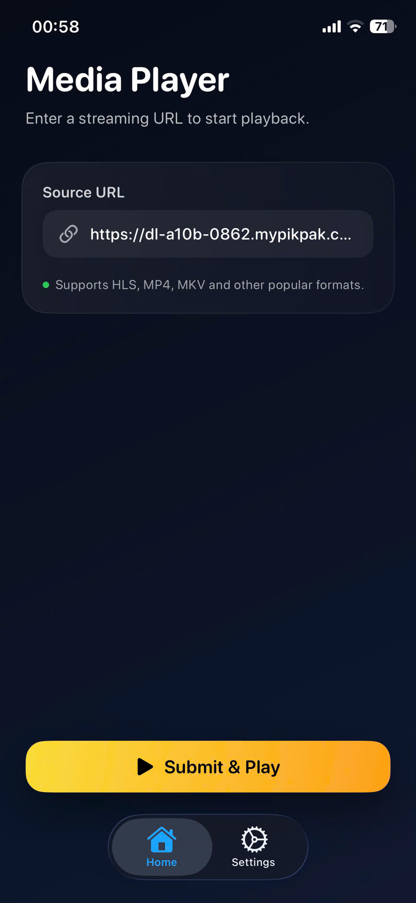
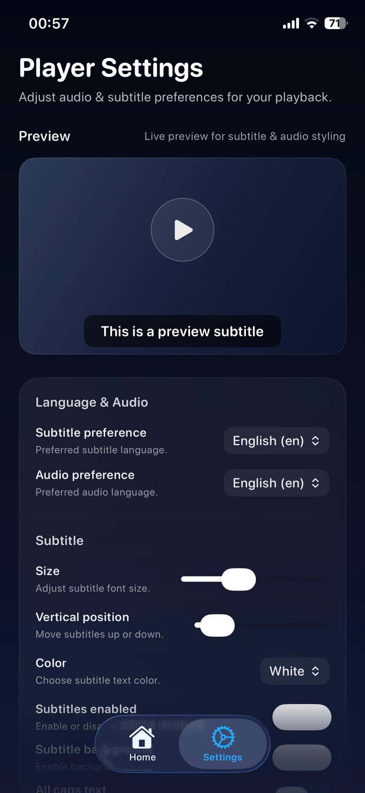
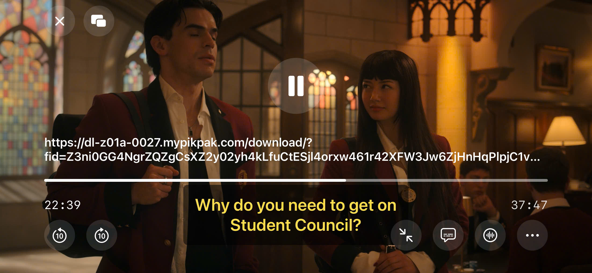

# media-player-ios

An iOS media player built around an FFmpeg-based playback pipeline (demux → decode → render), with SwiftUI UI and a full-screen player experience.

# PREVIEW

<table>
  <tr>
    <td></td>
    <td></td>
    <td></td>
  </tr>
</table>

## Project entry points

- App entry: `player/player/playerApp.swift` → `AppView`
- Home URL input: `player/player/Screen/HomeScreen/HomeScreenView.swift`
- Settings: `player/player/Screen/SettingScreen/SettingScreenView.swift`
- Player UI: `player/player/Screen/PlayerScreen/PlayerView.swift`
- Playback logic: `player/player/Core/Player/FFmpegPlaybackEngine.swift`